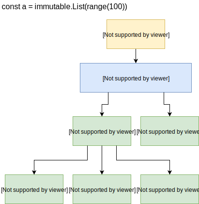
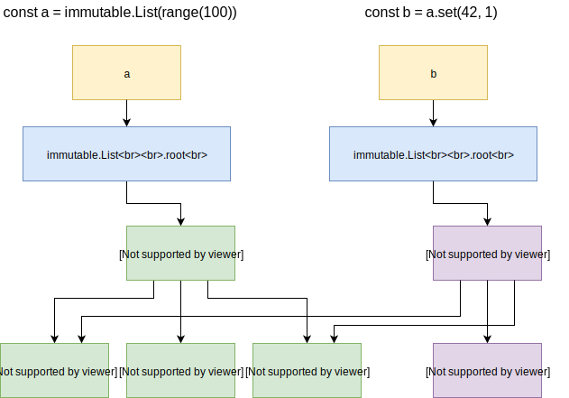
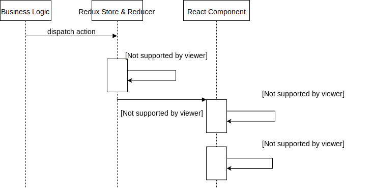
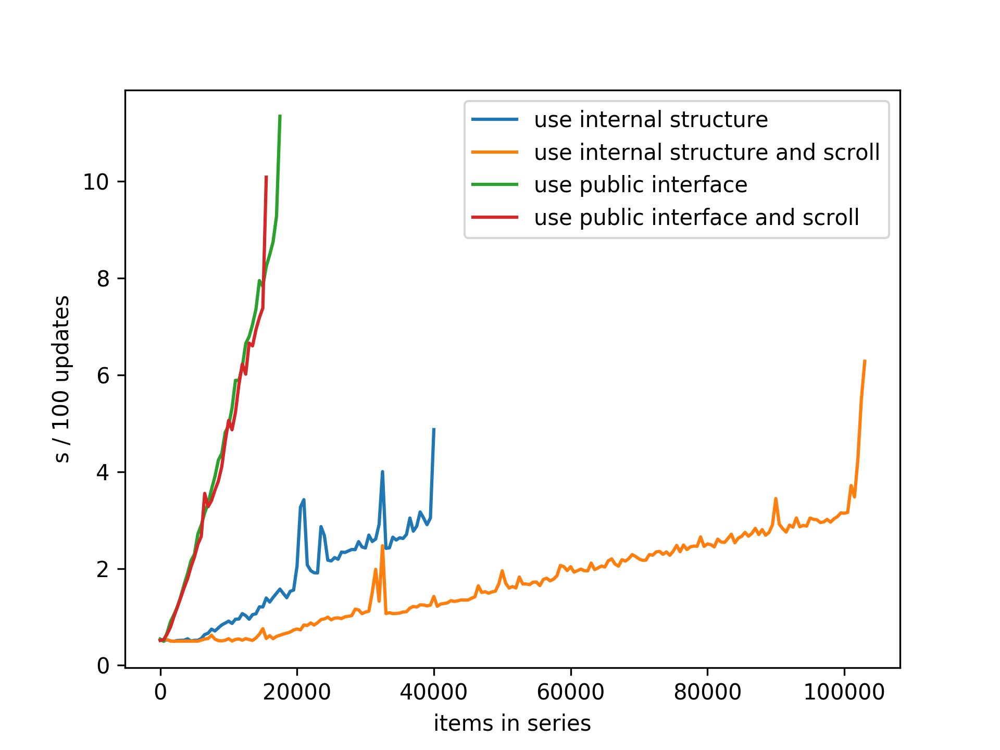
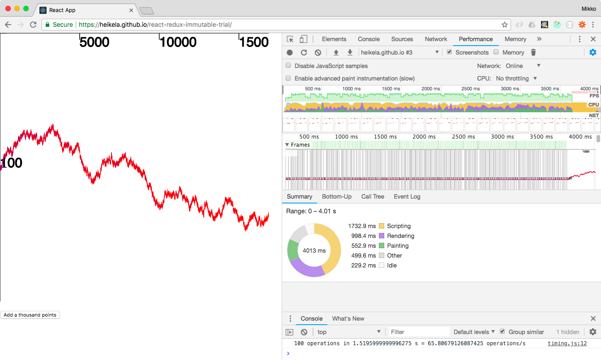
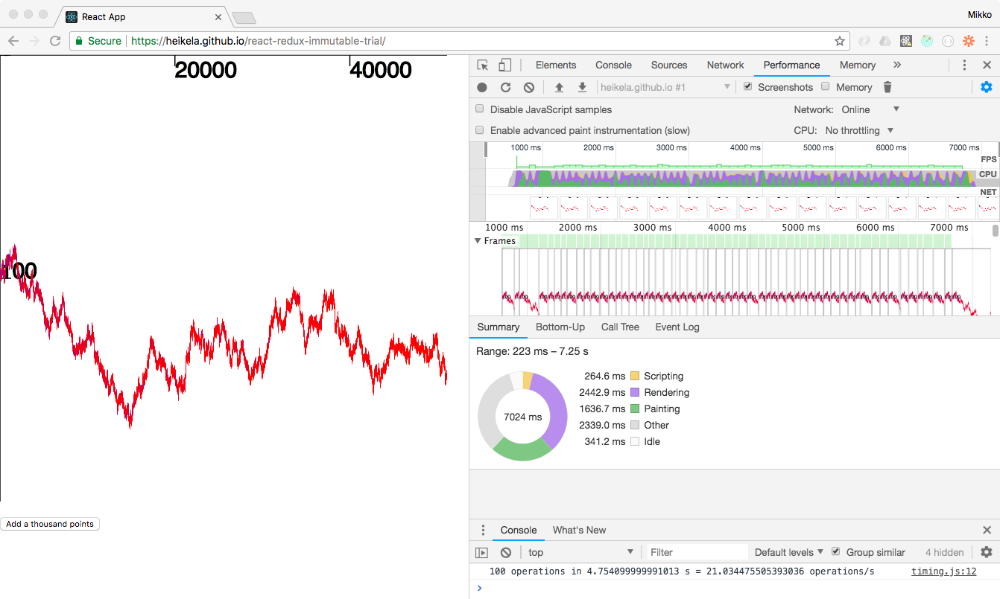
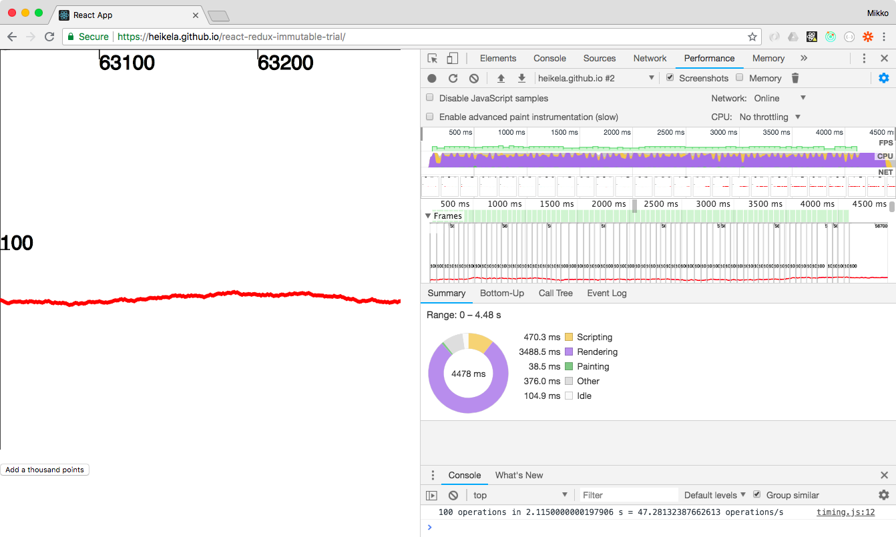

# React Redux Immutable SVG experiment

[Immutable](http://facebook.github.io/immutable-js/) is a javascript library
that offers efficient [persistent](https://en.wikipedia.org/wiki/Persistent_data_structure)
Lists, Maps and other related data structures. Immutable is often used in
implementing dynamic collections as part of a [Redux](https://github.com/reactjs/redux)
 store, e.g. in a [React](https://facebook.github.io/react/) app.
In this context, the potential performance benefits of persistent data structures
are easily lost. In this repository I experiment on how exposing the internal
structure of Immutable.List affects rendering performance of a time series
displayed as SVG, as well as other computations over the list as it is being
continuously updated. Using the internal structure allows much more efficient
updates of the SVG graph as well as efficient bounds computations after updates.

*This is not an app or a library and nothing in this repository is intended for
production use.*

## Challenge

The persistent nature of List from [Immutable](http://facebook.github.io/immutable-js/)
allows efficient updates through structural sharing between old and updated versions.
The way the sharing works is illustrated in Figures 1. and 2.

*Figure 1. The overall structure of an Immutable.List object. Each VNode contains
up to 32 pointers to VNodes at a deeper level or values held in the list in the case of the leaf VNodes.*

*Figure 2. After creating an updated version of an existing List. The old and new
version share much of their structure.*

If the List is used in a Redux store, and React components updated by connecting to the store,
this efficiency is lost because the public API of Immutable List does not expose the
underlying structural sharing, leading to expensive updates to React components,
as illustrated in Figure 3.

*Figure 3. The public API of Immutable.List does not allow React to components
to update only the changed parts of a visualisation of an Immutable collection.*

## Approach

In this repository I've experimented with building a UI based on the
above-mentioned technologies, but with a small patch to Immutable List that
allows client code to walk through the VNodes used internally.

As a test case I use time-series-like data. The code rapidly appends new items into a
series while also updating some existing elements. I have included
(mouse wheel based) horizontal zooming and scrolling functionality both to make
it easy to explore the performance impact of off-viewport graphics, and to
explore how the scrolling logic can be factored into its own components.

The ability to walk the VNode structure is used both for creating React
components that represent the data in the list graphically, and for calculating
a bounding box for the data for zooming purposes. In either of these cases it's
important to cut this process short when nothing has changed, instead of
recursing through the whole tree that holds the data for the List. When
generating React components, this is done by returning false from
`shouldComponentUpdate` when a component receives the same VNode as props as it
did on a previous render call. In the bounds calculation the same is achieved by
using a `WeakMap` for memoizing the calculation with the VNode as the key.

## Lessons learned

The above approach results in fairly nice performance. On a laptop, updates to
a List containing tens of thousands of items, represented on the screen with an
SVG image with a circle for each item are fast if only a small part of the whole
series is visible. If a larger portion is visible, rendering and painting starts
to get slow even though the Render code in the client app as well as React
reconciliation are still quick.

Immutable List is not the perfect data structure for the demonstrated case. This
is evidenced by the noticeable pauses when the number of elements exceeds 2^10
(1024) and 2^15 (approx. 32.7k), which means adding a new level to the VNode
tree, and consequently a failure to recognise similarities between old and new
trees in React reconciliation.

Opening Redux devtools slows things down very significantly - not surprising as
they diff the large state structures without being aware of the underlying
sharing.

## Results

Figure 4. shows how using the internal structure of Immutable.List results in
a dramatic performance improvement. Moreover, by looking at Chrome devtools,
we find out that javascript execution is the limiting factor in the naive
implementation (using the public interface of Immutable.List) already with a low
number of items in the series (Figure 5.), whereas browser native paint
work and in the case where many items are visible also render work dominates
the workload when using the internal structure of Immutable.List across
React and Redux (Figures 6 & 7.).

*Figure 4. Timing results. Measuring how long it takes to do 100 updates of
an SVG time series graph as a function of existing items in the series.
Measurements on a MacBook Air (13-inch, Early 2015) using Chrome Version
67.0.3396.99 (Official Build) (64-bit). The scenarios include an approach
where the internal tree structure of the immutable list is used at React level
and one where the public interface of immutable list is used (losing track of
structural sharing between updated versions of the list). Both are measured
in the scenario where all items in the time series remain in view, as well
as in a scrolling scenario where only the latest 1000 items remain in view.*

*Figure 5. For a small number of items, the a high FPS is achieved, and the javascript work,
render work and paint work are all comparable.*

*Figure 6. Using the internal structure of Immutable.List, the javascript work
remains manageable, but browser native paint and render work grow when
the number of items grows large.*

*Figure 7. When only a small number of items in a large time series remain in view,
the paint workload remains low in addition to the javascript workload,
but render work still starts to slow things down.*

## Instructions

This experiment is created with
[create-react-app](https://github.com/facebookincubator/create-react-app),
so the usual commands `npm start`, `npm run build` and `npm test` work.
To get started, immutable-js needs to be cloned, patched and built.
A script, `setup-immutable.sh`, is provided for this purpose.

Any benchmarking should naturally be done using production builds.

You can also check out a pre-built
[demo](https://heikela.github.io/react-redux-immutable-trial), but don't forget
it running in a background tab as it will start using considerable memory and
CPU time within minutes.
